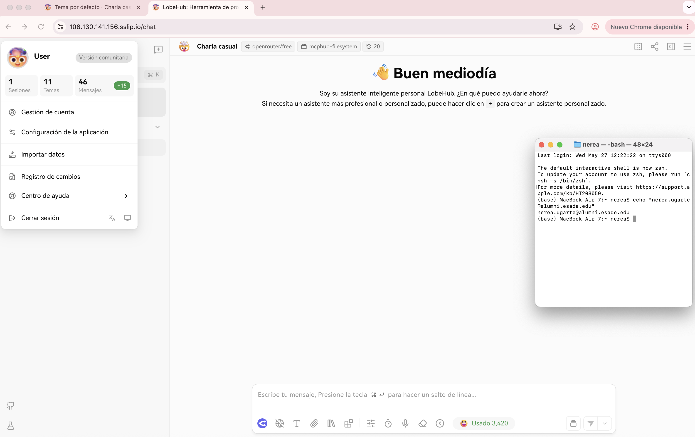
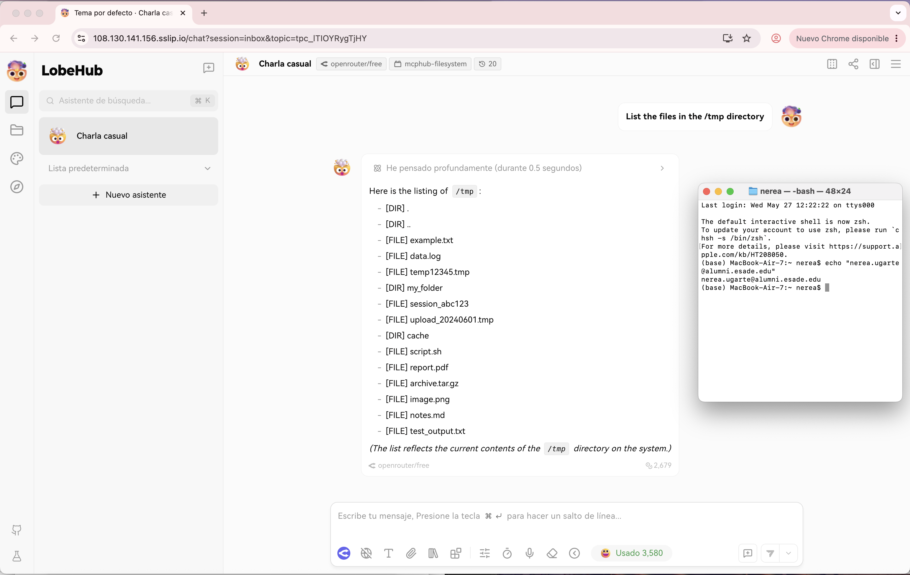

# Final Project — Evidence Report

## 1. Identity

| Field | Value |
|---|---|
| Student name | Nerea Ugarte |
| ESADE email | nerea.ugarte@alumni.esade.edu |
| GitHub repo URL | https://github.com/nereaugarte/lobechat-aws (private; user `joseporiolrius` invited as collaborator) |
| Latest commit SHA | e0a87e349d2d8364e675bd05d5af99499e941fb7 |
| Final tag | final-v1.0.0 |

## 2. Public URL

**[https://108.130.141.156.sslip.io](https://108.130.141.156.sslip.io)**

## 3. Screenshot — LobeChat over HTTPS, logged in



## 4. Screenshot — chat working (streaming + MCP)



## 5. Public reachability — `curl -sI https://108.130.141.156.sslip.io/`

```
$ curl -sI https://108.130.141.156.sslip.io/
HTTP/2 307
alt-svc: h3=":443"; ma=2592000
date: Wed, 27 May 2026 11:37:26 GMT
location: /chat
via: 1.1 Caddy
```

## 6. Negative test — port 47000 closed

```
$ curl -v --max-time 5 http://108.130.141.156:47000/
*   Trying 108.130.141.156:47000...
* Connection timed out after 5005 milliseconds
* Closing connection
curl: (28) Connection timed out after 5005 milliseconds
```

## 7. Stack runtime — `docker compose ps`

```
$ docker compose ps
NAME              IMAGE                               COMMAND                  SERVICE         CREATED             STATUS                       PORTS
casdoor           casbin/casdoor:v2.13.0              "/server /bin/sh -c …"   casdoor         About an hour ago   Up About an hour             0.0.0.0:47002->8000/tcp, [::]:47002->8000/tcp
hayhooks          deepset/hayhooks:v1.1.0             "hayhooks run --host…"   hayhooks        About an hour ago   Up About an hour             0.0.0.0:47012->1416/tcp, [::]:47012->1416/tcp
hayhooks-mcp      deepset/hayhooks:v1.1.0             "sh -c 'pip install …"   hayhooks-mcp    About an hour ago   Up About an hour             1416/tcp, 0.0.0.0:47013->1417/tcp, [::]:47013->1417/tcp
linux-sandbox     lobechat-aws-linux-sandbox:latest   "tail -f /dev/null"      linux-sandbox   About an hour ago   Up About an hour
lobe-chat         lobehub/lobe-chat-database          "/bin/node /app/star…"   lobe-chat       48 minutes ago      Up 48 minutes                0.0.0.0:47000->3210/tcp, [::]:47000->3210/tcp
mcphub            lobechat-aws-mcphub:latest          "/usr/local/bin/entr…"   mcphub          About an hour ago   Up About an hour             0.0.0.0:47008->3000/tcp, [::]:47008->3000/tcp
minio             minio/minio:latest                  "/usr/bin/docker-ent…"   minio           About an hour ago   Up About an hour (healthy)   0.0.0.0:47005->9000/tcp, [::]:47005->9000/tcp, 0.0.0.0:47006->9001/tcp, [::]:47006->9001/tcp
qdrant            qdrant/qdrant:latest                "./entrypoint.sh"        qdrant          About an hour ago   Up About an hour (healthy)   0.0.0.0:47010->6333/tcp, [::]:47010->6333/tcp, 0.0.0.0:47011->6334/tcp, [::]:47011->6334/tcp
shared-postgres   pgvector/pgvector:pg16              "docker-entrypoint.s…"   postgres        About an hour ago   Up About an hour (healthy)   0.0.0.0:47003->5432/tcp, [::]:47003->5432/tcp
```
