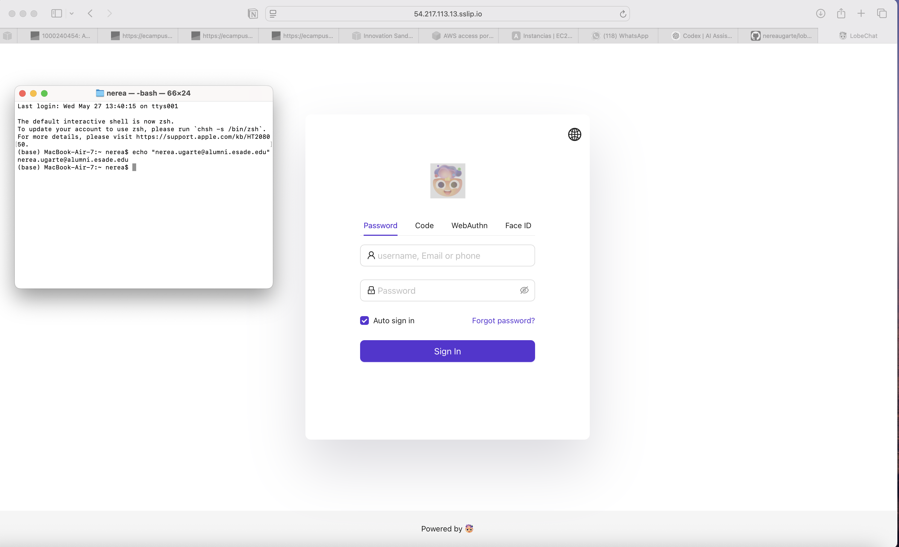
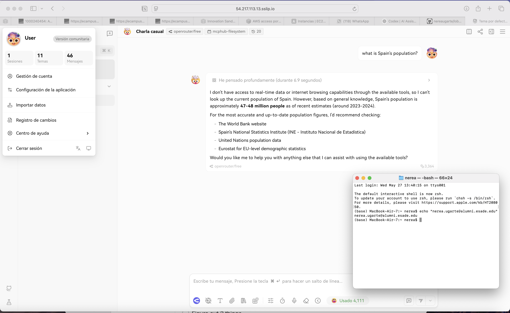
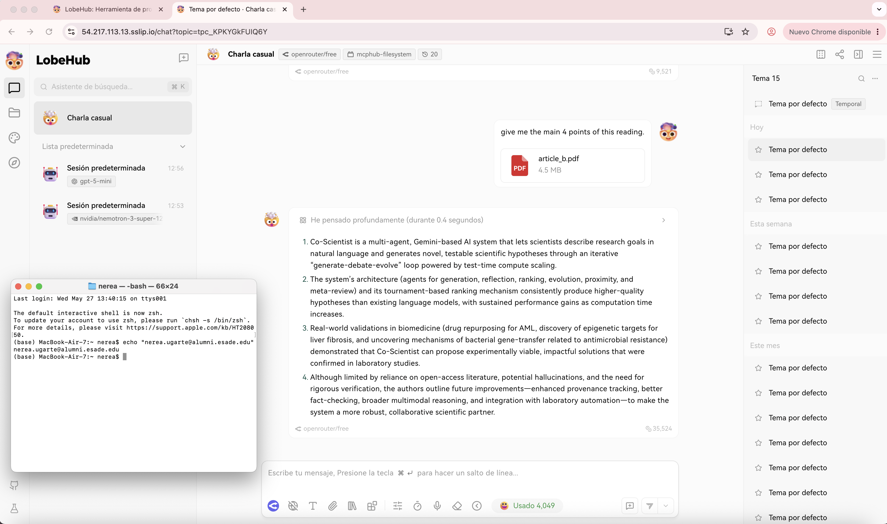
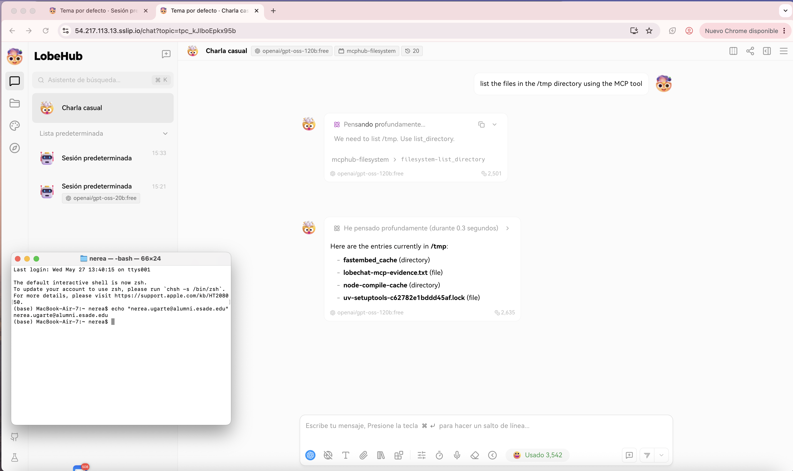

# Final Project — Evidence Report

## 1. Identity

| Field | Value |
|---|---|
| Student name | Nerea Ugarte |
| ESADE email | nerea.ugarte@alumni.esade.edu |
| GitHub repo URL | https://github.com/nereaugarte/lobechat-aws (private; user `joseporiolrius` invited as collaborator) |
| Latest commit SHA | ae19ed2a43957c5bf32cc5fa3809088e353b886e |
| Final tag | final-v1.0.0 |

## 2. Public URL

**[https://54.217.113.13.sslip.io](https://54.217.113.13.sslip.io)**

## 3. Screenshot — Casdoor login page over HTTPS



URL bar shows `54.217.113.13.sslip.io`, valid HTTPS, Casdoor SSO login form rendered — no certificate warning.

## 4. Screenshot — LobeChat logged in, chat streaming working



User `nerea.ugarte@alumni.esade.edu` logged in. Chat response streaming via `openrouter/free` model. MCP plugin (`mcphub-filesystem`) active in toolbar.

## 5. Screenshot — File upload to MinIO working



PDF file (`article_b.pdf`, 4.5 MB) uploaded from chat and summarised by the model — confirms MinIO S3-compatible storage integration is functional end-to-end.

## 6. Screenshot — MCP tool invoked and returned result



`mcphub-filesystem` → `filesystem-list_directory` called with `path=/tmp`. Tool returned directory listing (`fastembed_cache`, `lobechat-mcp-evidence.txt`, `node-compile-cache`, `uv-setuptools-c62782e1bddd45af.lock`) inline in chat. Model `openai/gpt-oss-120b:free` via OpenRouter.

## 7. Public reachability — `curl -sI https://54.217.113.13.sslip.io/`

```
$ curl -sI https://54.217.113.13.sslip.io/
HTTP/2 307
alt-svc: h3=":443"; ma=2592000
date: Sun, 31 May 2026 13:50:35 GMT
location: /chat
via: 1.1 Caddy
```

HTTP/2, redirects to `/chat`, served via Caddy — confirms HTTPS is live with a valid certificate.

## 8. Negative test — port 47000 closed

```
$ curl -v --max-time 5 http://54.217.113.13:47000/
*   Trying 54.217.113.13:47000...
* Connection timed out after 5002 milliseconds
curl: (28) Connection timed out after 5002 milliseconds
```

Direct EC2 access on port 47000 is blocked by the AWS Security Group — only ports 80/443 are public.

## 9. Stack runtime — `docker compose -f docker-compose.production.yml ps`

```
$ docker compose -f docker-compose.production.yml ps
NAME              IMAGE                               COMMAND                  SERVICE         CREATED       STATUS                    PORTS
casdoor           casbin/casdoor:v2.13.0              "/server /bin/sh -c …"   casdoor         3 hours ago   Up 52 minutes             0.0.0.0:47002->8000/tcp, [::]:47002->8000/tcp
hayhooks          deepset/hayhooks:v1.1.0             "hayhooks run --host…"   hayhooks        4 days ago    Up 52 minutes             0.0.0.0:47012->1416/tcp, [::]:47012->1416/tcp
hayhooks-mcp      deepset/hayhooks:v1.1.0             "sh -c 'pip install …"   hayhooks-mcp    4 days ago    Up 52 minutes             1416/tcp, 0.0.0.0:47013->1417/tcp, [::]:47013->1417/tcp
linux-sandbox     lobechat-aws-linux-sandbox:latest   "tail -f /dev/null"      linux-sandbox   4 days ago    Up 52 minutes
lobe-chat         lobehub/lobe-chat-database          "/bin/node /app/star…"   lobe-chat       2 hours ago   Up 9 minutes              0.0.0.0:47000->3210/tcp, [::]:47000->3210/tcp
mcphub            lobechat-aws-mcphub:latest          "/usr/local/bin/entr…"   mcphub          3 hours ago   Up 52 minutes             0.0.0.0:47008->3000/tcp, [::]:47008->3000/tcp
minio             minio/minio:latest                  "/usr/bin/docker-ent…"   minio           3 hours ago   Up 52 minutes (healthy)   0.0.0.0:47005->9000/tcp, [::]:47005->9000/tcp, 0.0.0.0:47006->9001/tcp, [::]:47006->9001/tcp
qdrant            qdrant/qdrant:latest                "./entrypoint.sh"        qdrant          4 days ago    Up 52 minutes (healthy)   0.0.0.0:47010->6333/tcp, [::]:47010->6333/tcp, 0.0.0.0:47011->6334/tcp, [::]:47011->6334/tcp
shared-postgres   pgvector/pgvector:pg16              "docker-entrypoint.s…"   postgres        4 days ago    Up 52 minutes (healthy)   0.0.0.0:47003->5432/tcp, [::]:47003->5432/tcp
```

All 9 services running: LobeChat, Casdoor SSO, PostgreSQL+pgvector, MinIO, MCPHub, Qdrant, Hayhooks, Hayhooks-MCP, Linux-sandbox.
